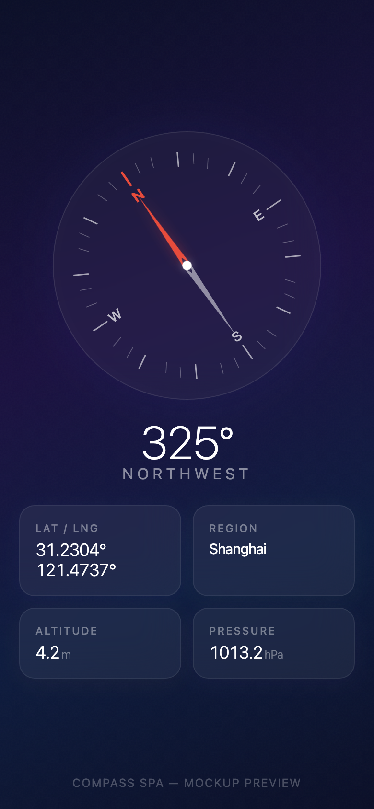

# Compass SPA

A pure frontend compass web app optimized for iOS Safari. Shows a real-time compass with location and atmospheric data in a glassmorphism UI.

一个纯前端指南针网页应用，针对 iOS Safari 优化。毛玻璃风格界面，实时显示指南针、定位及气象数据。

## Features / 功能

- **Compass** / 指南针 — Real-time heading via device magnetometer (`DeviceOrientationEvent`)
- **Lat / Lng** / 经纬度 — GPS coordinates via `Geolocation API`
- **Region** / 地区 — Reverse geocoding via OpenStreetMap Nominatim
- **Altitude** / 海拔 — GPS altitude with Open-Meteo elevation fallback
- **Pressure** / 气压 — Atmospheric pressure via Open-Meteo weather API

## Preview / 预览

<p align="center">
  
</p>

> Open on an iPhone to see the compass in action. Desktop browsers show the UI but compass rotation requires a device with a magnetometer.
>
> 在 iPhone 上打开可体验完整功能。桌面浏览器可预览界面，但指南针旋转需要带有磁力计的设备。

## Tech Stack / 技术栈

- **Vite + TypeScript** — Build toolchain
- **Pure CSS** — Glassmorphism style, zero UI frameworks
- **SVG** — Compass rendering
- **Zero runtime dependencies** — All vanilla, ~10KB gzip

## Getting Started / 快速开始

```bash
# Install dependencies / 安装依赖
npm install

# Development server / 开发服务器
npm run dev

# Build for production / 构建生产版本
npm run build
```

## Deployment / 部署

The `dist/` directory is included in the repository. Deploy it directly to any HTTPS static server.

`dist/` 目录已包含在仓库中，直接部署到任意 HTTPS 静态服务器即可。

> **HTTPS is required** — Device sensor APIs and Geolocation only work on secure origins.
>
> **必须使用 HTTPS** — 设备传感器和定位 API 仅在安全来源下可用。

## Permissions / 权限

On first visit, the app shows a welcome screen. Tapping "Start" requests:

1. **Motion sensors** — For compass heading (iOS requires user gesture)
2. **Geolocation** — For coordinates, altitude, and API data lookup

Permissions are remembered via `localStorage`. Subsequent visits go directly to the compass.

首次访问时显示欢迎页面，点击"Start"后依次请求运动传感器和定位权限。授权状态保存在 `localStorage` 中，之后每次访问直接进入指南针界面。

## License / 许可

MIT
